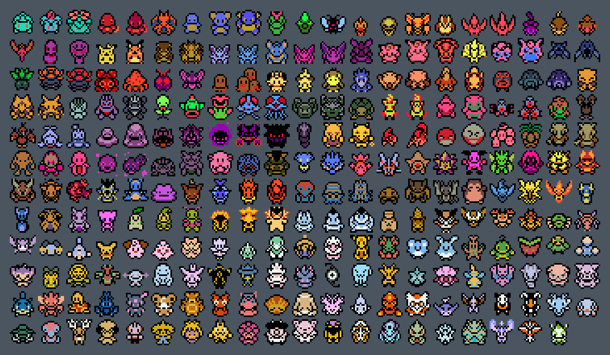
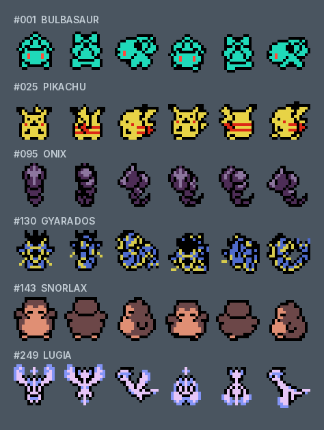
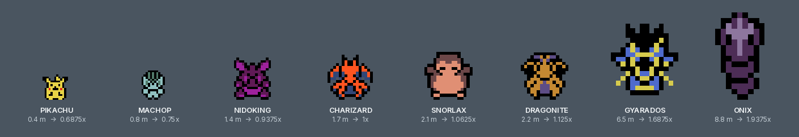

<p align="center">
  
</p>

<p align="center">
  <b>Gen 1 + Gen 2 overworld followers, all 251 of them</b><br>
  For <b>Pokémon Red, Blue, Yellow and Gold</b> on Gen1Recomp.
</p>

<p align="center">
  <br>
  <i>Every sprite that ships, #001 to #251, straight out of
  <code>assets/sprites/</code>.</i>
</p>

An all-species overworld follower mod for **Pokémon Red, Blue, Yellow, and Gold (Gen1Recomp)**. Every Generation I Pokémon is supported out of the box; Gold supplies all 251 species natively, while Gen 1 can add Johto species through a compatible expansion such as **Crystal 251**.

Gen1Follower is a standalone build of the PokéPC Followers lineage, released under its own identity and version numbering. It is not a fork of that repository and does not track its releases — see [Credits & acknowledgments](#-credits--acknowledgments).

---

## 🌟 Features

* **All 251 Gen 1 + Gen 2 Pokémon Supported**: Every Pokémon from Bulbasaur `#001` to Celebi `#251` has full overworld sprite animations.
* **Crystal 251 Compatibility**: Johto species are detected from Crystal 251's registered Pokédex data instead of relying on a second hard-coded species table.
* **Automatic Party Slot 1 Follower**: By default, your overworld follower automatically mirrors whichever Pokémon is in **Party Slot 1**. Swapping your party order or receiving a new lead Pokémon dynamically updates your overworld companion.
* **Party Menu UI Selection**:
  1. Press `START` -> select `POKéMON`.
  2. Choose any Pokémon in your party.
  3. Select the new **`FOLLOW?`** option (the current follower reads **`FOLLOWER`**).
  4. Your chosen Pokémon will instantly become your active follower!
* **Full-Color Overworld Graphics**: Sprites render with rich true-color graphics directly over 100% colorized overworld terrain tiles (grass, paths, dirt, water) with zero background artifacts.
* **Pokédex-Proportional Sizes**: Followers use the height recorded in their Pokédex entry. A progressive and capped scale keeps the smallest Pokémon at least 11 px tall while making very large Pokémon clearly more imposing, without changing collision or movement.
* **Smooth Movement Mechanics**:
  * Smooth 1-tile trailing behind the player.
  * In-place turning (no teleporting or jumping tiles when turning around).
  * Seamless map transition spawning across route seams and indoor/outdoor warps.

### What a sheet holds

Every species ships one 16x96 sheet: six frames, standing and stepping, for
each way the follower can face.

<p align="center">
  
</p>

The sheets on this page are redrawn from the committed sprites by

```sh
python3 tools/make_showcase.py          # every sheet
python3 tools/make_showcase.py sizes    # ... or just the ones named
```

It needs `Pillow`, and fetches its label font from Google Fonts once into
`tools/.cache/`, which is not committed.

---

## 📋 Installation

**Gen1Follower requires Gen1Recomp 0.1.86 or newer.** Install `Gen1Follower-<version>.zip` from the GitHub release through `MODS > Import mod .zip`, or place the unpacked mod inside `mods/`.

The sandbox entry point is `main_sandbox.lua`; it loads the follower implementation through Gen1Recomp's scoped mod APIs.

On Red, Blue, or Yellow, install and import **Crystal 251** to use Pokémon `#152`–`#251`. On Gold, all 251 species work directly from the game's own Pokédex data.

The manifest targets both `gen1` and `gen2`; no second Gold-specific copy of the mod is needed.

> **Coming from `PokePCFollowers`?** Disable it before enabling Gen1Follower. The launcher treats them as two separate mods, and running both installs two copies of the same follower, renderer and party-menu hooks.

### Follower size options

<p align="center">
  <br>
  <i>The scale beside each name is this repo's own formula from
  <code>main.lua</code> applied to that Pokémon's Pokédex height.</i>
</p>

`POKEDEX SIZES` enables or disables proportional follower sizes. `FOLLOWER SIZE`
adjusts the result globally from 75% to 125%. The default 100% setting uses the
Pokédex-derived scale. Only the visual sprite changes: followers still occupy one
logical map cell and retain their normal movement and interactions.

---

## Gen1Recomp 0.1.86+ sandbox compatibility

The mod runs inside the Gen1Recomp per-mod sandbox and does not request raw filesystem access. Its own asset paths are rooted through `mod.assets:path(...)`, its implementation core is read through `mod:read(...)`, and cross-mod integration goes through `mod.find(...).exports`.

No `debug.getupvalue` fallback is required at runtime: the sandbox entry installs a narrow follower-spawn compatibility seam before the implementation loads. This keeps Red/Blue follower spawning functional even though the sandbox intentionally does not expose the Lua `debug` library.

## 👥 Credits & acknowledgments

* **Lineage**: Gen1Follower is built from the PokéPC Followers codebase ([mfrtechconsult/PokePCFollowers](https://github.com/mfrtechconsult/PokePCFollowers), by Antigravity & gamecorner33). All of that project's follower mechanics, fixes and compatibility work are retained here; the branding, release pipeline and version numbering are this project's own.
* **Generation I + II Overworld Sprites**: Huge credit and special thanks to ShockSlayer, the makers of the legendary ROM hack **Pokémon Crystal Clear**, and the PokéPC / Followers EX lineage for the native GSC-style follower sheets. The Generation II sheets are distributed in the built-in Poke Followers pack from [Wilds of Kanto](https://github.com/YoDrehDenSwagAuf/overworld-spawn-mod). See [THIRD_PARTY_NOTICES.md](THIRD_PARTY_NOTICES.md).
* **Crystal 251 Integration**: Species identities and National Pokédex numbers are read from [Crystal 251](https://github.com/Deftones565/gen1recomp-mod-crystal-251) at runtime. No Crystal ROM content is bundled by this mod.

## Voxel compatibility

This build includes compatibility for Dramatic Shape-family voxel providers. The follower sprite is resolved dynamically through `SpriteRenderer:resolveImage()` as well as the normal 2D draw hook, preventing voxel mode from sampling the registered Charmander fallback sheet for every follower.

The follower sprite is also marked `trueColor` for render-pipeline use so the voxel renderer does not run the fixed `SPRITE_PIKACHU` image through its palette bake. Pokédex-derived sizes are forwarded to the billboard and shadow meshes used by Dramatic Shape, Dramaless Shape and Battle Art Voxel Fork.

## Inter-mod compatibility

The renderer, party-menu, follower and Yellow encounter wrappers are chain-safe. During a hot reload the mod restores a function only when its own wrapper is still the active outermost function, so wrappers installed by later-loading mods are not overwritten. This is intended for stacks containing Dramatic Sky Ride, Kanto Dive or the standalone Dramatic Deep Dive; those mods remain responsible for their own mount and underwater movement rules.

When [Unique Menu Icons](https://github.com/menyas/unique-menu-icons) is also enabled, it owns the party-menu icon column and its color mode. Gen1Follower keeps providing the overworld follower and the `FOLLOW?` action, but stops marking the party rows as true color. Without Unique Menu Icons, Gen1Follower's own party icons remain the fallback. Use Unique Menu Icons 1.5.0 or newer; version 1.4.0 declares the PokéPC-lineage mod incompatible in its manifest.

### Provider contract

`mod.exports.providerRepository` reports `wild1walker/Gen1Follower`. Consumers that matched the PokéPC provider string literally can read `mod.exports.upstreamRepository`, which still reports `mfrtechconsult/PokePCFollowers`. The sprite contract itself — `mod.exports.resolveFollowerSprite{ species = ... }` returning `{ image, frames, walker, trueColor, providerId }` — is unchanged.

The `__pokepc*`, `pokepcFollower*` and `ICON_POKEPC_` markers written onto engine and third-party tables also keep their historical names on purpose: they are how one PokéPC-lineage follower mod detects that another has already installed its wrappers. Renaming them would let two lineage mods stack wrappers on the same engine functions.

## Red/Blue follower support

The mod extends the follower entity to Pokémon Red and Pokémon Blue. The stock Gen 1 `PikachuFollower` spawn condition is Yellow/Pikachu-specific, so Gen1Follower supplies a version-neutral healthy-party condition while retaining the engine's native trailing, ledge and map-transition behavior.

Yellow-only Oak story/encounter overrides remain restricted to Yellow and are not applied to Red, Blue, or Gold.

## Gold support

Gen1Follower targets the Gen 2 engine directly. It uses Gold's follower spawn seam, native 251-species Pokédex, Gen 2 sprite registry, and split icon sheet/species registry. Followers are hidden correctly while biking or surfing, and the Party Menu `FOLLOW?` action uses the same shared hook as Gen 1.

## Fainted lead handling

Under the 0.1.86+ sandbox, a naive spawn shim makes the follower vanish whenever
party slot 1 is at 0 HP, even with a different healthy Pokémon selected. The
native Gen 1 spawn gate scans the party for a mon that is both named `PIKACHU`
and above 0 HP, so spoofing slot 1's species without its HP fails the gate and
no other slot matches. The shim borrows the selected follower's own slot
instead, so both halves of the native test are satisfied by the same mon without
mutating any HP value.

A fainted Pokémon is also never drawn as the follower: the renderer, the
party-menu resync check and the follower-size handler all resolve healthy-only,
matching `shouldSpawn`. While the chosen follower is fainted the first healthy
party member follows instead, and the stored selection resumes as soon as it is
revived.

## Animation

The follower sprite definition is explicitly marked as a walking sprite (`walker=true`). Gen1Recomp uses this flag to provide the `walkPhase` state used by the 6-frame overworld sheets, so the follower switches between standing and walking frames correctly.
